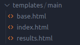
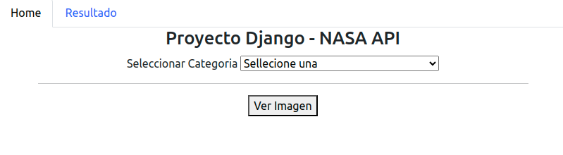

# TPN3: Consultas de Apis con Django

## Índice
1. Descripción de la API
2. Funcionamiento
3. Modo de trabajo
4. Bibliografia

## Descripción de la API: NASA API
La API de la NASA ofrece una variedad de servicios y datos relacionados con las misiones espaciales, imágenes, y otros recursos científicos y de investigación de la NASA. Una de sus funcionalidades es la de subir a una base de datos diarimente una imagen, la cual lleva el nombre de APOD, por sus siglas en ingles de imagen astronomica del dia.
A su vez cuenta con otras imagenes como la de los diferentes rovers que exploran marte.

## Estructura
Dentro del archivo **form.py** encontramos diferentes funciones y clases, las cuales se encargan de convertir los parametros obtenidos en direcciones url para poder realizar los diferentes request. Tambien encontramos la clave primaria la cual nos sirve para poder usar la API.

A su ves en la carpeta **templates** encontramos tres archivos diferentes, partiendo de una bases (base.html) los otros dos son extenciones que muestran diferente contenido que es insertado a modo de bloques dentro de la base.

## Funcionamieto
La pagina se inicia en el index donde tenemos un menu desplegable para elegir o APOD o una imagen del rover Opportunity. Si seleccionamos APOD se mostrara otro menu para poder elejir el dia de la imagen, esto no sucede si selecionamos la imagen del rover. 

Despues de seleccionar todos los valores apretamos **"Ver Imagen"** para visualizar la informacion que porporciona la API. Esto te llevara a la pagina **Resultado**, y para volver a hacer otra request volvemos a la pagina Home desde el nav bar.

## Modo de Trabajo
Para cumplir con la consigna, con la nesesidad de usar un framework CSS, use Bootstrap para crear un navbar. 
Para mostrar la informacion en tabla, cree una con Categoria, Descripcion y Imagen como columnas para mostrar la informacion obtenida por la API.

## Bibliografía
* Documentación oficial de Bootstrap: https://getbootstrap.com/docs/5.3/getting-started/introduction/
* Documentación oficial de Nasa.Api: https://api.nasa.gov/
* Documentacion oficial de Django: https://docs.djangoproject.com/en/5.0/