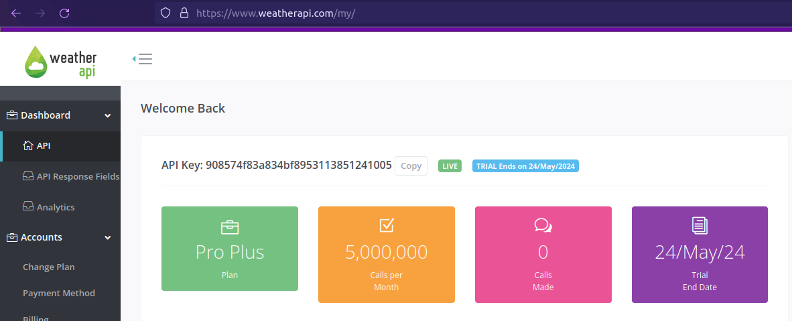
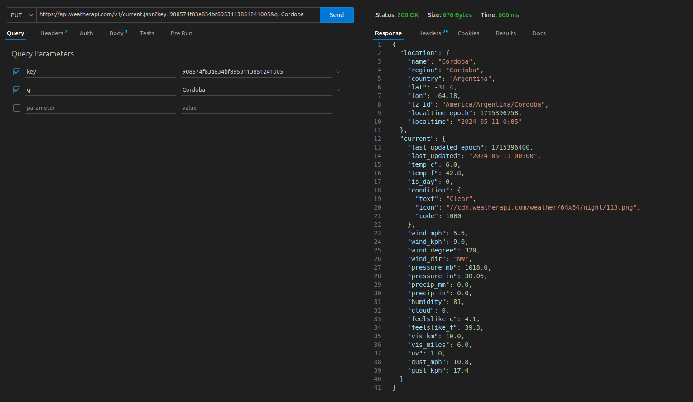
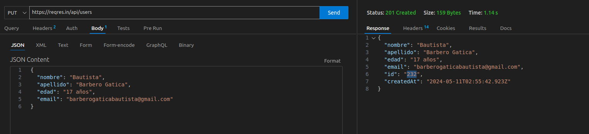
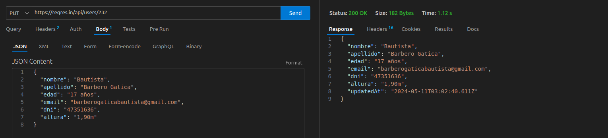
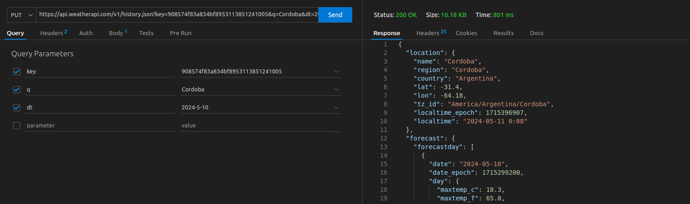
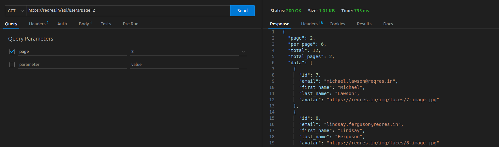

# Informe sobre la API de WeatherApi y Reqres

## Índice
1. Descripción de las API
2. Creación de Cuenta y Generación de Clave de Autenticación
3. Consulta GET Genérica
4. Consultas POST y PUT
5. Consulta GET de Búsqueda por ID
6. Consulta de búsqueda utilizando dos claves de consulta distintas
7. Consulta de Búsqueda Lógica
8. Capturas de Pantalla
9. Conclusiones
10. Bibliografía

## Descripción de las APIs (WeatherApi, Reqres)
La API WeatherAPI es un servicio que proporciona información meteorológica y pronósticos del tiempo a través de una interfaz de programación de aplicaciones (API, por sus siglas en inglés). Esta API es utilizada por desarrolladores y empresas para integrar datos meteorológicos en sus aplicaciones, sitios web y servicios.

La API WeatherAPI ofrece una amplia gama de funcionalidades y datos relacionados con el clima, incluyendo:

    Pronósticos del tiempo: Proporciona pronósticos del tiempo actualizados para ciudades de todo el mundo, incluyendo detalles como temperatura, humedad, velocidad del viento, precipitaciones y más.

    Información histórica: Permite acceder al historial del clima para una ubicación específica en fechas anteriores. Esto puede ser útil para análisis retrospectivos, investigación y modelado climático.

    Alertas meteorológicas: Ofrece alertas meteorológicas en tiempo real para condiciones climáticas adversas, como tormentas, tornados, nevadas, entre otras, ayudando a mantener a los usuarios informados y seguros.

    Datos de calidad del aire: En algunas regiones, la API WeatherAPI también proporciona información sobre la calidad del aire, incluyendo índices de calidad del aire y datos de contaminantes atmosféricos.

## Creación de Cuenta y Generación de Clave de Autenticación
**Crear una cuenta:** Ingrese al la pagina web de wather api para poder registrarme

**Generar la clave de API:** Busque en mi cuenta mi API key y la utilice, **APIKEY:** 908574f83a834bf8953113851241005


## Consulta GET Genérica
Para obtener datos de la API de WeatherApi, use una consulta generica GET para obtener una con las temperatura del dia de hoy de Cordoba

Aquí está la solicitud del GET:
>GET https://api.weatherapi.com/v1/current.json?key=908574f83a834bf8953113851241005&q=Cordoba



## Consultas POST y PUT
Para modificar datos en la API, utilice las consultas POST y PUT para crear y actualizar usuarios respectivamente.

Aquí está la solicitud del POST:
>POST https://reqres.in/api/users

Y en la parte del body con formato json:
```
{
  "nombre": "Bautista",
  "apellido": "Barbero Gatica",
  "edad": "17 años",
  "email": "barberogaticabautista@gmail.com"
}
```


Aquí está la solicitud del PUT:
>PUT https://reqres.in/api/users/232

Y en la parte del body con formato json:
```
{
  "nombre": "Bautista",
  "apellido": "Barbero Gatica",
  "edad": "17 años",
  "email": "barberogaticabautista@gmail.com"
  "dni": "47351636",
  "altura": "1,90m"
}
```


## Consulta GET de Búsqueda por ID
Para obtener datos de la API de Reqrest, use una consulta generica GET para obtener un solo usuario.

Aquí está la solicitud del GET por ID:
>GET https://reqres.in/api/users?id=6


## Consulta de búsqueda utilizando dos claves de consulta distintas
Se pueden utilizar dos parámetros de consulta distintos para filtrar los resultados de la búsqueda.

Aquí está la solicitud del GET con dos claves:
>GET https://api.weatherapi.com/v1/history.json?key=908574f83a834bf8953113851241005&q=Cordoba&dt=2024-5-10



## Consulta de Búsqueda Lógica
Se puede realizar una consulta para encontrar usuarios con ciertos criterios lógicos, como encontrar usuarios por paginas.

Aquí está la solicitud del GET por busqueda logica:
>GET https://reqres.in/api/users?page=1



## Capturas de Pantalla
A continuación se muestran capturas de pantalla que demuestran los resultados esperados de las consultas realizadas:


## Conclusiones
En conclusión, la API WeatherAPI es una herramienta esencial para obtener datos meteorológicos precisos y actualizados que pueden ser integrados en una variedad de aplicaciones y servicios. Proporciona información detallada sobre el clima actual, pronósticos del tiempo, datos históricos y alertas meteorológicas, lo que permite a los desarrolladores y empresas ofrecer a sus usuarios información relevante y útil sobre las condiciones climáticas


## Bibliografía
* Documentación oficial de WeatherApi: https://www.weatherapi.com/
* Documentación oficial de Reqres: https://reqres.in/